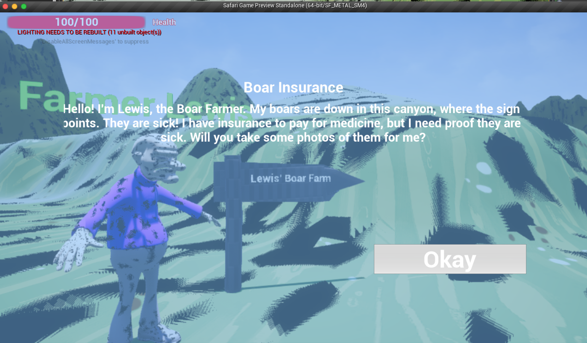

Safari Game
-----------
Kirk A. Boyer
-------------

This is a game I made for a game programming class at the University of Denver. 
The object of the game is to take photos of stuff and complete quests for NPCs by 
doing so. 
 
The biggest challenge in making this game was to get Unreal Engine 4 to actually 
capture what it was rendering to the screen unchanged (i.e. with postprocessing and 
everything else, but *without* UI elements), for the "photo-taking" effect, in 
such a way that the game itself had access to these photos. 
 
A notable feature of the game, more apparent to a developer than a player, is the 
generic "pop-up" window UI element I created. It made use of UE4's built-in UI system 
in a way that allowed me to create pop-ups with customizable buttons and text, and 
most importantly whose buttons could *trigger events*, also in a customizable way. 

Gameplay Images:

Images of Blueprint Code:
* Main Scene Blueprint

* Blueprints within the main character's blueprint

